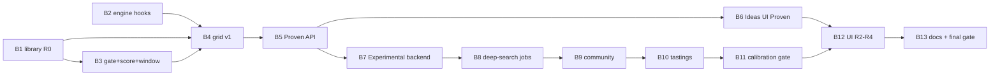

# Fermentation recommender: build plan and phase contracts

**Date:** 2026-10-08
**Design:** `docs/superpowers/specs/2026-10-07-fermentation-recommender-design.md` (the "design"). § references below point there.
**Curation:** `docs/superpowers/specs/2026-10-07-recipe-curation.md` (the "curation spec").
**Branch / worktree:** `feat/recommender-spec` in `.worktrees/recommender`.

Every phase below is a **handoff contract**:
- a dedicated implementer builds it;
- a reviewer gates it (tests + code review, PASS / CHANGES REQUIRED);
- a handoff validator checks the contract (ACCEPT / REJECT);
- only then does the orchestrator commit it and start the phases that depend on it.

Implementers do not commit.

## 0. Environment and conventions (all phases)

**Python:** the repository's virtualenv lives in the main checkout, and its editable install points at the main checkout's `src`. In the worktree, always run with the worktree's `src` first on the path:

```powershell
$wt = "<repo>\.worktrees\recommender"; $env:PYTHONPATH = "$wt\src"; Set-Location $wt
..\..\.venv\Scripts\python.exe -m pytest -q tests/<files>      # targeted
..\..\.venv\Scripts\python.exe -m ruff check src tests scripts
..\..\.venv\Scripts\python.exe -m mypy --python-version 3.12 --follow-imports=silent <touched modules>
```

**Frontend:** `cd frontend; npm run build` (Vite). Hash routes live in `frontend/src/App.jsx` (`#/batch/<id>`, `#/levain?p=…` for a shared sourdough plan).

**Conventions:**
- Match existing style: ruff (line 100, rules E F I UP B), mypy strict, `# fmt: skip` where the codebase uses it, and dataclasses for engine-side values.
- Tests mirror existing ones: async API tests use `client` / `db_session` from `tests/conftest.py`.
- Tests co-land with the code in the same phase.
- No new runtime dependencies (numpy/scipy only). Inline comments only for non-obvious logic.

**Auth:**
- `get_current_user_id` is used for owned data.
- Admin endpoints reuse `fermenttrack.auth.require_admin` and **`FERMENTTRACK_ADMIN_USER_IDS`**, which already exist. This supersedes the design's proposed `FERMENTTRACK_ADMIN_SUBS`.

**Migrations:** linear, pre-assigned, never two phases in parallel:

| revision | phase | adds |
|---|---|---|
| 0019 | B5 | `recommendation_links` |
| 0020 | B8 | `recommendation_jobs` |
| 0021 | B9 | `community_recipes`, `community_recipe_forecasts` |
| 0022 | B10 | `tastings` |
| 0023 | B11 | `calibration_reports` (if a table is needed) |

**Safety invariants** (every phase):
- the gate (design § 7) is applied before anything is served;
- predicted pH is never presented as clearance;
- cards for lactic and koji types always carry the mandatory pH lines.

**Baseline:** the test suite, ruff and mypy results on `master@c438cd9` are recorded in § 3. A phase may not add failures. Pre-existing ones are not that phase's job.

## 1. Phase graph



**Waves** (parallel where the file sets are disjoint and there are no migrations in both):
1. {B1, B2}
2. {B3}
3. {B4}
4. {B5}
5. {B6, B7}
6. {B8}
7. {B9}
8. {B10}
9. {B11}
10. {B12}
11. {B13}

## 2. Phase contracts

Each contract lists **owns** (files the phase may create or modify), **must** (acceptance criteria) and **hands off** (what the next phase relies on). Touching files outside **owns** needs a one-line justification in the handoff summary.

### B1: recipe library (R0), design § 4, curation spec

**Owns:**
- `scripts/build_recipes.py`
- `src/fermenttrack/recommender/__init__.py`, `library.py`
- `src/fermenttrack/recommender/recipes_v1.csv`, `recipe_ingredients_v1.csv`
- `src/fermenttrack/routers/recipes.py`, plus one `include_router` line in `main.py`
- `RecipeOut`-style schemas, appended at the end of `schemas.py`
- `tests/test_recommender_library.py`, `tests/test_recipes_api.py`

**Must:**
1. **Build script.** `build_recipes.py` is deterministic and reads the research drafts (`docs/superpowers/research/recipes/*_draft_v0.*.csv`). It applies **every** curation decision in the curation spec §§ 3, 3a, 4: status changes, ingredient fixes and splits, renames, the cider temperature change, the Q25 widening and clipping rule (curation § 1 rule 4), the Q32 stand-in, `temp_schedule`, and sourdough exclusions. Decisions are encoded as data in the script, each with a comment citing the spec section, or parsed from the spec's tables (like `scripts/build_aroma_compounds.py` does). `--check` exits non-zero if the committed v1 files differ from a fresh build.
2. **v1 recipe columns:** the brief's columns, plus:
   - `temp_schedule`, as `h:°C;h:°C` or empty;
   - `envelope_basis`, `sourced` or `widened_single_value`;
   - `model_scope`, derived from `prediction/profiles.py` (`in_range`, `temp_outside_profile`, `beyond_horizon`);
   - `handoff`, which is `planner` for sourdough and otherwise empty;
   - `planner_style`, the sourdough catalogue style key.

   Ingredient rows add `label`, for example `stand-in species: Pacific sand lance`, or a note such as "dried powder booked as fresh chili".
3. **Status sets:**
   - **Active (exactly 20):** the 13 curated recipes (curation § 2) plus the 7 sourdough styles.
   - **Draft:** dill pickles, carrot sticks, barley koji, budu.
   - **Not in v1:** poolish, biga, Type III.
4. **`library.py`:**
   - `load_library()`, cached;
   - frozen dataclasses `Recipe` and `RecipeIngredient`;
   - `active()` and `get(key)`;
   - `STAPLES`: salt, water, sugar, flour, tea leaves, starter cultures, by catalogue name;
   - `ingredient_tier(name, ferment_type) -> int` (0–3), derived per design § 12:
     - T0 = a catalogue name from `seed_data` (all versions, minus `RETIRED_V3`);
     - T1 = has an FDC mapping (`INGREDIENT_FDC_MAP` or `INGREDIENT_FDC_IDS_V4`);
     - T2 = a key in `AROMA_INGREDIENTS`;
     - T3 = a row in `ingredient_use_levels_v1.csv` when that file exists (it arrives in B7).
5. **Validation tests:**
   - every active recipe's core ingredients are T0 or above;
   - `fermentation_type` is a profile key;
   - ingredient medians sum to 1000 ± 5 % (sourdough levain builds included);
   - an `active` recipe has no missing T, duration or salt (where salt applies);
   - every `AROMA_INGREDIENTS` key is a catalogue name or appears in an explicit, commented `ALIASES` set;
   - `--check` passes.
6. **API:** `GET /recipes?type=&status=active` and `GET /recipes/{key}`, **no auth** (public library data). Each recipe includes ingredients, envelope, provenance, sources, labels and `model_scope`.

**Hands off:** the `Recipe` API, `ingredient_tier`, `STAPLES`, the v1 CSV schema.

### B2: engine hooks, design § 9

**Owns:**
- `src/fermenttrack/prediction/service.py`, plus `model.py` only if needed
- `tests/test_prediction_hooks.py`

**Must:**
1. **`PredictionInputs.planned_temperature: tuple[tuple[float, float], ...] = ()`**, a step schedule of `(start_hour, °C)`.
   - With no temperature readings, `_schedule` uses it in place of the constant estimate.
   - A what-if `temperature_c` replaces the **first stage only** and keeps later stages.
   - Empty means byte-identical behaviour and **identical fingerprints** to before. A test pins a fingerprint computed on the unmodified code.
2. **`predict(..., members: int | None = None)`** and **`member_values(..., members: int | None = None)`** set the ensemble size; `None` means today's `N_MEMBERS` / `N_FALLBACK`.
   - `members` is part of the output cache key.
   - The posterior cache must not serve a 160-member posterior for a 64-member request, or the reverse; key it, or resample.
3. Tests cover:
   - a staged schedule (for example `0:20;48:4`) slows acidification after 48 h compared with a constant 20 °C;
   - the what-if shifts only the first stage;
   - `members=64` returns 64-member arrays from `member_values`;
   - an existing forecast is unchanged.

**Hands off:** a hook signature summary for B4 and B5.

### B3: gate, score, window, design §§ 5.3, 6, 7

**Owns:**
- `src/fermenttrack/recommender/gate.py`, `score.py`, `window.py`
- `tests/test_recommender_gate.py`, `tests/test_recommender_score.py`, `tests/test_recommender_window.py`

**Must:**
1. **`gate.check(recipe_like, temperatures) -> GateResult(ok, reasons, safety_lines)`**, exactly per design § 7:
   - SALT-001/002 scoped to `lacto_ferment`, on % w/w of the total from the ingredient rows;
   - TEMP-001 for lactic types;
   - KOJI-001 and KOJI-002, including the certified-starter exception;
   - mandatory `safety_lines` for lactic and koji types: the pH-by-48 h line, and the vinegar acidity lines from the curation spec (vinegar is not a gate rule).

   "Lactic types" = every profile except koji, which follows `safety/service.py`'s mapping; the salt rules are restricted to `lacto_ferment` as the design says.
2. **`score.py`**, pure numpy:
   - `soft(L, tau=0.25)`;
   - `central(L, w)` = Σ w σ(L/τ);
   - `optimistic(L, w)` = the weighted P90;
   - `noticeable(L, w)` = Σ w 1[L > 0];
   - target averaging;
   - `character_series(parent_reported, parent_P_at_dmed)`;
   - `off_note_penalty(var_P, par_P, targets, character, lam=0.5)`, with O = {solvent, sulfurous, fishy, cheesy, phenolic};
   - `low_med_high(E)`, with thresholds 0.33 and 0.67.

   τ, λ and the thresholds are module constants.
3. **`window.compute(...)`** per design § 6. Inputs: the per-time E series, P series of the off-notes, the safety milestone P90 time, the documented duration (lo, med, hi), the horizon, and the mode. Output: `Window(taste_from_h, peak_h, stop_by_h, notes)`.
   - Proven and Community are clipped to `d_hi`. Experimental may go to 1.5 · `d_hi`. Taste-from is never below `d_lo`.
   - With no targets, the peak is `d_med` time-shifted by the milestone ratio (takes `m_user`, `m_source` medians).
   - When `model_scope` has `beyond_horizon`, the peak is searched only up to the horizon, and a note is added.
4. Tests: hand-built arrays for every rule, including edge cases (no targets, off-note before the peak, milestone later than `d_lo`, beyond horizon) and every gate rule at its boundary values.

**Hands off:** the function signatures and the constants.

### B4: grid v1, design § 8

**Owns:**
- `src/fermenttrack/recommender/grid.py`
- `scripts/build_recommender_grid.py`
- `src/fermenttrack/recommender/recommender_grid_v1.npz` and `recommender_grid_v1.manifest.json`
- `tests/test_recommender_grid.py`

**Must:**
1. **Entries:** every **active** library recipe at 3 temperatures, per § 8.1: `temp_range[0]`, `temp_c`, `temp_range[1]`, with the recipe's own temperature replacing the nearest of the three; for `temp_outside_profile`, the nearest in-range temperature is used.
   - Staged recipes use `planned_temperature`; the temperature axis shifts the first stage.
   - Sourdough styles use `bake.member_values` with the catalogue defaults for that style.
   - Operator entries are **out of scope here**; B7 extends the grid.
2. **Running a recipe:**
   - A recipe becomes `PredictionInputs` like a logged batch: `RecipeIn` from the v1 ingredient rows and the FDC `per_100g` of their catalogue foods (via the existing composition path), the profile's default organisms, no readings, and `expected_temperature_c` or `planned_temperature`.
   - Horizon = min(1.5 · `d_hi`, profile horizon).
3. **Stored per entry:**
   - per series, for the 16 aroma series + 4 tastes: E, U, P on 24 log-spaced times plus `d_lo`, `d_med`, `d_hi` (float16);
   - milestone crossing P10, P50 and P90 per profile milestone;
   - metadata: the evidence tier of the top compound per series, and `not_modelled` ingredients.
4. **Manifest** per § 8.3, including the hashes of every input and `MODEL_VERSION`.
   - `grid.py` loads lazily, exposes `entry(recipe_key, temp)`, `temps(recipe_key)` and `interp_temp(...)`, and verifies the hash on load (in tests).
   - `test_grid_is_current` fails with the rebuild command on any input change; `test_grid_size` checks ≤ 5 MB.
5. **Builder:** `--workers N` (multiprocessing, each process its own solve lock); deterministic; prints the time and size. **Run it**, and commit the artefact and manifest.

**Hands off:** the `grid.py` API, the stored statistics schema, the build time and the size.

### B5: Proven API, design §§ 5, 10.1, 11

**Owns:**
- `src/fermenttrack/recommender/service.py`
- `src/fermenttrack/routers/recommendations.py`
- schemas appended to `schemas.py`
- `RecommendationLink` appended to `models.py`
- `alembic/versions/0019_recommendation_links.py`
- `tests/test_recommendations_api.py`, `tests/test_recommender_eval.py`, `tests/test_migration_0019.py`

**Must:**
1. **`POST /recommendations`**: the request per § 5.1; `mode=proven` here (`experimental` and `both` return only the Proven section until B7).
   - Candidates per § 5.2 (Proven); the gate; scores from the grid; ranking per § 5.4; windows per § 6; up to 3 cards, one per parent.
   - Each card per § 11.1: structured recipe scaled to `batch_g` (default 1000); window at the requested or recipe temperature, interpolated across grid temperatures; Low/Med/High per target; trust labels; safety lines; sourdough `handoff: planner` with a `planner_link` (`#/levain?p=…`, the existing share format).
   - Auth: required (anonymous sessions are fine).
2. **`POST /recommendations/forecast`**: stateless; card recipe plus `temperature_c`; a live `predict(members=64)`; returns the window, E and U at the peak, and small series bands. Runs in the threadpool like the existing prediction route. For sourdough, it returns the planner link instead.
3. **`POST /batches/from-recommendation`**: one transaction that:
   - creates or selects the culture (owned);
   - creates the batch with expected temperature (or schedule, stored in a way the forecast reads; document which) and `BatchIngredient` rows (catalogue names only; optional `new` rows are skipped and listed in the response);
   - creates the pH reminder for lactic and koji types;
   - writes `recommendation_links` (§ 11.2 columns).

   Sourdough is rejected with 409 and `planner_link`.
4. **Offline evaluation** (`test_recommender_eval.py`), run on the committed grid: E1 (≥ 90 %), E3 (≥ 80 %, unclipped), E4 (0 violations over all served cards for 500 seeded random requests), E5 (byte-identical JSON). Each prints its measured value and *n*. If E1 or E3 miss their target, the test reports the value and `xfail`s strictly with the measured number recorded in the handoff; the owner decides. Do not tune silently.
5. E6: a local timing test for `POST /recommendations` from a warm grid (record the number; assert < 1.5 s locally as a proxy).

**Hands off:** the request and response JSON schema (a pasted example), and the endpoint list.

### B6: Ideas page, Proven (frontend)

**Owns:**
- `frontend/src/ideas/*` (new)
- `frontend/src/App.jsx` (route `#/ideas` plus a nav entry)
- `frontend/src/sourdough/Planner.jsx`: only to accept a `rec` id from the hand-off link and include it on save, if the backend from B5 supports it. Otherwise leave a TODO in the handoff, not in code.

**Must:**
1. Ingredient picker (catalogue `GET /ingredients`) and aroma/taste chips: 16 series + 4 tastes, with low-resolution badges on phenolic, vinegary and fishy; maximum 3 targets. Mode toggle (Proven / Experimental / Both, with Experimental disabled until B7). Optional temperature.
2. Cards per § 11.1: Low/Med/High (never numbers yet), trust labels, safety lines, sources, temperature slider (calls `/recommendations/forecast`), **Start batch** (calls `/batches/from-recommendation`, then opens `#/batch/<id>`), sourdough **Open in planner**.
3. Wording rules (flavour spec § 7): "likely noticeable", never "tastes like".
4. `npm run build` passes. Smoke-check the page in a browser against a local API (`uvicorn` with a SQLite `FERMENTTRACK_DATABASE_URL`, `alembic upgrade head`) if feasible; otherwise state why.

**Hands off:** component map, and screenshots or a description.

### B7: Experimental backend (R2), design §§ 5.2, 8.5, 12

**Owns:**
- `src/fermenttrack/recommender/operators.py`, `screen.py`, `ingredient_use_levels_v1.csv`
- changes to `library.py` (T3), `service.py`, `grid.py`, `scripts/build_recommender_grid.py`
- grid artefacts (rebuilt)
- `tests/test_recommender_operators.py`, `tests/test_recommender_screen.py`, plus extensions to existing recommender tests

**Must:**
1. **`ingredient_use_levels_v1.csv`** (§ 12 T3 columns), bootstrapped **only** from shares in active library recipes. Source = that recipe's source plus locator. Only for ingredients that are T2 for that type. Add a header comment row or README note that the lacto-ingredients research round adds rows. No unsourced rows.
2. **Operators (i), (ii), (iii), (v)** per § 5.2. Salt and sugar % are preserved by rescaling. Sourdough uses only (ii) flour swap and (iii). Every variant passes the gate.
3. **Grid:** add every single operator per active recipe, at the same temperatures. Rebuild; keep ≤ 5 MB, or follow § 8.2's fallback and report.
4. **Screening:** combinations of up to **3** operators; additive logit screening per § 8.5 (clip ±6); labelled "screened". Lazy confirmation runs through `/recommendations/forecast` with `members=64`. If the confirmed E(peak) < 0.8 × the screened value, the card shows "interaction detected". Confirmed results are cached by fingerprint and logged (a JSONL or table entry under a documented path) as grid and emulator candidates.
5. **Experimental section:** ranked by U − penalty (§ 5.4), with the off-note penalty relative to the parent; `mode=both` returns both sections.
6. **Own-batch parent** (`parent_batch_id`, Q16): owned batch only; live forecasts; at most 3 variants.
7. Tests: operators (salt preserved, gate, bounds), screening math, E2 (≥ 60 %, same xfail-and-report rule as E1), E4 over variants (2 000 seeded combinations), own-batch auth (404 or 403 for someone else's batch).

**Hands off:** an operator catalogue summary, grid size and time, and the E2 value.

### B8: search deeper (background jobs), design § 10.2

**Owns:**
- `src/fermenttrack/recommender/jobs.py`
- router additions in `recommendations.py`
- `RecommendationJob` model
- `alembic/versions/0020_recommendation_jobs.py`
- startup hook in `main.py` (lifespan)
- `tests/test_recommendation_jobs.py`, `tests/test_migration_0020.py`

**Must:**
1. `POST /recommendations/deep-search` returns `202 {job_id}`. `GET /recommendations/jobs/{id}` returns `{status, done, total, eta_s, results[]}` (owner only).
2. A single in-process asyncio worker drains a FIFO queue persisted in `recommendation_jobs`, with one active job per owner (409 otherwise). It runs at most 20 live 64-member forecasts in the order set by § 10.2 and writes partial results as it goes.
3. On startup, `queued` and `running` jobs are re-queued. Results are cached by request fingerprint and logged as grid candidates.
4. Tests: lifecycle (queued → running → done) with a stubbed forecast; one active job per owner; resume after a simulated restart; ownership.

**Hands off:** the job API and statuses.

### B9: community recipes, design § 10.3

**Owns:**
- `src/fermenttrack/recommender/community.py`
- `src/fermenttrack/routers/community.py`
- `CommunityRecipe` and `CommunityRecipeForecast` models
- `alembic/versions/0021_community.py`
- changes to `routers/me.py`: `DELETE /me` detaches, `/me/export` includes
- `tests/test_community.py`, `tests/test_migration_0021.py`

**Must:**
1. **Publish** from one's own **finished** batch, with every automatic check in § 10.3. The tasting-form check is enforced once B10 lands; until then, require the batch `outcome` and document the deferral.
2. **Admin queue** via `require_admin`. Approving enqueues forecast jobs (B8 worker), which store the grid statistics schema in `community_recipe_forecasts`. These are recomputed when the manifest hash changes, at startup.
3. **"Community — not proven" section** (at most 3 cards; ranked by E, then the count of tasted batches, then liking, which become live once B10 lands), and community recipes as Experimental parents.
4. **Privacy:** pseudonym; `DELETE /me` nulls `owner_id` and `source_batch_id`; `/me/export` includes published recipes. Test both.

**Hands off:** the community API.

### B10: tastings (R3), design § 11.2

**Owns:**
- `Tasting` model, `alembic/versions/0022_tastings.py`
- endpoints `POST`/`GET /batches/{id}/tastings`
- the stop-by reminder on `from-recommendation`
- the FermentJSON export addition
- the B9 publish-check switch to "tasting required"
- `tests/test_tastings.py`, `tests/test_migration_0022.py`

**Must:** fields per § 11.2 (0–3 per target, liking 1–5, `make_again`, notes, `t_h`), owner-only, on any batch. The stop-by reminder is created by `from-recommendation`. Community ranking now uses tastings.

### B11: calibration gate (R4), design § 13.2

**Owns:**
- `src/fermenttrack/recommender/calibration.py`
- a `GET /recommendations/calibration` route
- a `calibration_reports` table only if needed (migration 0023)
- the switch in `service.py` from Low/Med/High to numbers
- `tests/test_recommender_calibration.py`

**Must:**
- **Score:** the Brier score of P_s(t_tasting) against "noticed" (rating ≥ 1).
- **Baseline:** a per-type, per-series rate (leave-one-batch-out).
- **Pass rule:** the upper bound of the paired-bootstrap 90 % CI of (model − baseline) < 0, with 2 000 batch-level resamples (seeded numpy RNG).
- **Gate:** at least 30 tasted linked batches.
- **Report:** reliability bins (5), *n*.
- **Run:** a weekly recompute (on startup if the last report is > 7 days old, plus an admin trigger).
- **Display:** numbers only while the latest report passes ("calibrated on *n* batches").
- **Tests:** synthetic data that passes, fails and is too small.

### B12: frontend R2–R4

**Owns:** `frontend/src/ideas/*`, `frontend/src/BatchView.jsx` (tasting form entry point), `frontend/src/Account.jsx` (publish list, admin review link if admin), new small components.

**Must:**
1. Experimental section with operator chips and "screened" / "interaction detected" labels.
2. **Search deeper**, with the waiting message ("Exploring 7 / 20 combinations — about 3 min left. You can leave this page; results are kept."), polling every 5 s while visible, and cards appearing progressively.
3. Community section, publish-from-batch flow with pseudonym and the deletion disclosure, and an admin review page.
4. Tasting form at stop-by and on finish.
5. Numbers instead of Low/Med/High when the API says calibrated.
6. `npm run build` passes, and the same browser smoke-check as B6.

### B13: docs and final gate

**Owns:** `README.md`, the "implementation notes" sections of the design and curation specs, `docs/ADDING_AN_INGREDIENT.md` (fix test and file names to match reality).

**Must:**
- README: an "Ideas / recommender" section matching what shipped and its labels ("model-guided, not validated").
- Design spec status set to IMPLEMENTED, with implementation notes per phase (deviations, measured E1–E6, grid size and time).
- Full test suite, ruff and mypy compared with the baseline.
- A final quality review across all phases.

## 3. Baseline (`master@c438cd9`, recorded before B1)

- **pytest (full):** 600 passed, 65 xfailed, 0 failed. It took 26:47 while running alongside other agents; budget about 15–30 min.
- **ruff (`src tests scripts`):** 149 findings across 33 files that predate this work. Notable ones: `models.py` 19, `routers/batches.py` 21, `routers/me.py` 7, `schemas.py` 7. **Gate rule:** no new findings in touched files (compare per file; the baseline list is kept by the orchestrator). New files must be clean.
- **mypy:** plain `mypy src` stops early because numpy's stub uses 3.12 `type` statements while `python_version = 3.11`; this is pre-existing. **Command to use:** `python -m mypy --python-version 3.12 --follow-imports=silent <touched modules>`. Baseline under that command: 1 pre-existing error (`prediction/service.py:882` no-any-return). **Gate rule:** new modules are clean, and touched modules add no errors.

## 4. Gate protocol (per phase)

1. **Implementer** (dedicated agent) builds to the contract, runs targeted tests, ruff and mypy on the touched modules, and returns a **handoff summary**: files changed; how each "must" is met; deviations with reasons; commands run with results; open items.
2. **Reviewer** (`low-level-reviewer`): Stage 1 runs the phase's tests, ruff and mypy (targeted), plus the full suite at the end of each wave. Stage 2 reviews correctness, safety invariants, the edge cases above, and idempotence. Verdict: PASS or CHANGES REQUIRED.
   - CHANGES REQUIRED goes back to the **same** implementer; at most 2 rounds, then escalate to the owner.
3. **Handoff validator:** checks the diff and handoff summary against this contract. Verdict: ACCEPT or REJECT, with the unmet items.
4. **Orchestrator:** commits the phase (`feat(recommender): Bn …`, path-limited `git add`), records the handoff in § 5, and starts the dependent phases.

## 5. Handoff log

### B1 — recipe library (commit `8241879`)
- **Gates:** review PASS (9 deviations accepted; 6 optional follow-ups applied); handoff ACCEPT; orchestrator re-ran `build_recipes.py --check` (exit 0) and 49 tests (pass).
- **Interfaces (`library.py`):**
  - `load_library()`, `active()`, `get(key)`: returns drafts too, so serving code must use `active()`;
  - frozen dataclasses `Recipe`, `RecipeIngredient` and `Span`;
  - `STAPLES` (excludes Rennet), `CATALOGUE_NAMES`, `ALIASES`, `trust_labels(recipe)`;
  - `ingredient_tier(name, type)`: −1 = not a live catalogue name; T3 needs a use-level row **and** T2.
- **Recipe fields:** `Recipe.temp_schedule` is `tuple[(start_h, °C), …]`, the same shape as B2's `planned_temperature`.
- **Recipe counts:** 20 active (13 curated + 7 sourdough with `handoff=planner` and `planner_style`), 4 draft. Poolish, biga and Type III are absent.
- **Notes for later phases:**
  - Salt % comes from the ingredient rows (kimchi is 3.5 % including its optional rows).
  - The four planner styles have no duration, so B4 must handle that.
  - Sourdough rows book all wheat as `White wheat flour`; B4 should run the style's own flour through `bake`.
  - Sources are citation keys, defined in `research/recipes/01-*.md`.
- **For B13:** design § 4.1's wording "never the drafts" must change to "drafts plus encoded curation decisions".

### B2 — engine hooks
- **Gates:** review PASS (byte-identical against HEAD on 32 outputs; 15 new tests and 91 regression tests pass).
- **Signatures:**
  - `PredictionInputs.planned_temperature: tuple[tuple[float, float], ...] = ()`, a step schedule;
  - `predict(inputs, temperature_c=None, horizon_h=None, members=None)`;
  - `member_values(inputs, horizon_h, members=None)`.
- **Semantics:**
  - The plan sets the future and also fills the gaps between readings (deviation 7: it is used with readings too).
  - A what-if replaces the stage in effect at `now`.
  - An explicit `members` has no fallback.
  - The posterior cache is keyed `fp|members`.
  - Pooled learning comes only from the default ensemble.
  - The plan is reported as `source="expected"`, with the plan in the assumption line.
- **Notes for B4:**
  - Exactly `members` members only when there are no readings.
  - `member_values` depends on the cache state, so call `clear_caches()` per entry, or keep a fixed order, for a deterministic build.
  - Validate plans (NaN, duplicate hours) and `members ≥ 1` where recipes are parsed.
  - Cost: 64 members ≈ 0.65–0.7 × a 160-member run.
