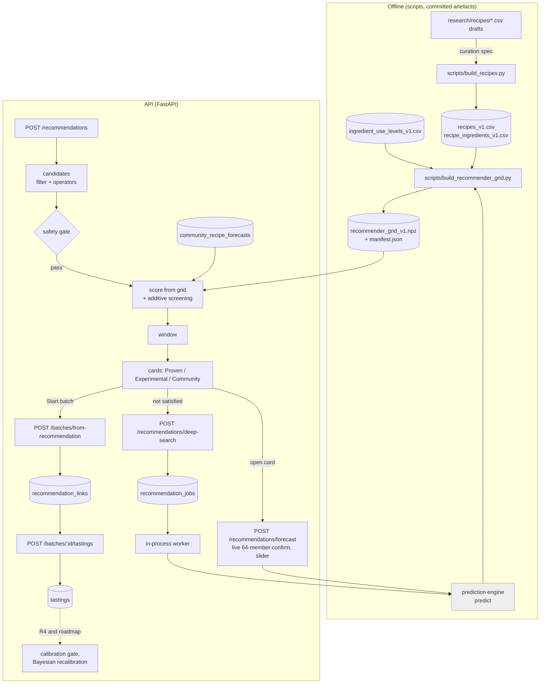

# Fermentation Recommender — Design

**Date:** 2026-10-07
**Status:** DRAFT. This is the outcome of a grilling session with the owner on 2026-10-07/08 (decisions Q1–Q33). Nothing is implemented yet.
**Builds on:**
- `2026-09-24-fermentation-prediction-design.md`: the kinetic ensemble, `predict()`, temperature schedules and milestones.
- `2026-10-02-flavour-nutrition-design.md`: taste activity, odour activity value (OAV), the "noticeable" probability, and its wording rules.
- `2026-10-05-aroma-curation.md`: the 85-compound catalogue, evidence tiers and `AROMA_INGREDIENTS`.
- `2026-09-18-experiment-logging-design.md`: `BatchIngredient` is the recipe.
- `2026-09-29-mobile-and-sharing-spec.md`: anonymous sessions and sharing.

**Companion documents:**
- `docs/ADDING_AN_INGREDIENT.md`: the ingredient plug-in contract.
- `docs/superpowers/research/recipes/BRIEF.md` and `01-*.md`: the curated recipe library drafts.
- `docs/superpowers/specs/2026-10-07-recipe-curation.md`: the library curation spec (R0), written after review of the drafts.

## 1. Problem and goals

The owner wants to start from **a few ingredients and/or a few target aromas** and get **recipes plus a fermentation time** back, in two flavours:
- a **"sure value"**: a proven recipe;
- an **experimental** idea.

Every piece needed already exists except the search itself:
- the forecast only runs forwards (recipe + conditions + time → pH, tastes, 16 aroma series, per member of the ensemble);
- there is no `Recipe` entity;
- the aroma layer already reports, per series, the ensemble probability of being **noticeable**: `derived._aroma_block`, `wn @ (log_v > 0)`.

Goals:

1. **Inputs:** ingredients (hard constraint), 1–3 target aromas or tastes (soft objective), or both.
2. **Three sections of results:**
   - **Proven**: a curated, cited recipe kept inside its documented envelope;
   - **Experimental**: up to 3 documented departures from a parent recipe;
   - **Community, not proven**: recipes users published from their own batches.
3. **Each card** is a full structured recipe with a **temperature-dependent time window**:
   - **taste from**: earliest time to start tasting;
   - **peak**: when the targets are strongest;
   - **stop by**: latest sensible time;

   plus one-click **Start batch**.
4. **Honest labels:** model-guided ideas, never a safety decision, never a validated aroma claim.
5. **Feedback** that makes the recommender measurable and, later, self-calibrating.
6. **Easy to grow:** more ingredients and more recipes plug in through documented, tested contracts.

Constraints:
- numpy/scipy only;
- Render free tier (0.1 CPU, 512 MB, sleeps when idle);
- one solve at a time per process (`_SOLVE_LOCK`);
- the forecast engine stays unchanged except for the two small hooks in § 9.

### Non-goals (v1)

- Cross-type recipes, such as koji plus lacto.
- An "avoid this aroma" input.
- Friendly aroma names ("funky").
- USDA-only ingredients in Proven.
- Automatic recalibration from tastings.
- A trained emulator or true inverse optimisation.
- Cheese ripening.
- Prose method instructions; the existing stage reminders guide the process.

All of these are on the roadmap in § 15.

### What this does not reverse

`IDEATION_CONTEXT.md` killed a "Predictive Flavor Engine". As in the flavour spec, the recommender never says "this will taste like X". It ranks by the **modelled probability that a compound family is noticeable**, and labels that as a model estimate (§ 11).

## 2. Decisions

| # | Topic | Decision |
|---|---|---|
| Q1 | Users | Pantry-first home fermenters ("I have cabbage and ginger"), aroma-first tinkerers ("fruity and funky"), and micro-producers exploring variants |
| Q2 | Modes | Two axes. **Provenance**: the recipe comes from a curated, cited library ("Proven") or departs from it ("Experimental"). **Model confidence**: the profile is `established` or `exploratory`, and the ensemble is uncertain. The library is curated like the aroma catalogue: draft CSVs → curation spec → build script → frozen `*_v1.csv` |
| Q3 | Inputs | Ingredients are **must-include**; staples (salt, water, sugar, flour, tea, starter culture) are always allowed. 1–3 aromas or tastes are a **soft objective**. Either input or both. No "avoid" list in v1 |
| Q4 | Output | Full structured recipe: type, quantified ingredients, salt and sugar, starter, temperature or `temp_schedule`, stages, window. One click creates the culture, batch and ingredients |
| Q5 | Time | A window (taste from / peak / stop by) at a stated temperature that moves with the temperature what-if |
| Q6 | Safety | **Hard gate in every mode** on rules that can be checked from the recipe (§ 7). Predicted pH is never treated as clearance. Every acid-safety card says "measure pH; it must reach ≤ 4.6 within 48 h" |
| Q7 | Vocabulary | All 16 aroma series plus 4 tastes (sour, sweet, umami, alcohol). Series backed by 2 compounds or fewer get a "low resolution" badge. Off-notes are handled by scoring (§ 5.3) |
| Q8 | Labels | Cards are "Model-guided ideas". Each shows provenance, profile confidence, aroma evidence tier, and "model estimate, not validated" |
| Q9 | Ingredients | Curated, model-mapped ingredients by default. USDA foods are allowed in Experimental, labelled "aroma effect unknown". Growth follows the plug-in contract (§ 12) |
| Q10 | Compute | A **precomputed, versioned grid** (§ 8) plus a stateless live forecast per card. An emulator is a later step (§ 15.2) |
| Q11 | Score | The ensemble probability that each target is noticeable, at the peak, averaged over targets. A parent-relative off-note penalty applies to Experimental only. Proven ranks by the central score; Experimental by the optimistic (P90) score |
| Q12 | Window | Formulas in § 6. Proven is clipped to the documented duration. Experimental may run to 1.5× the documented maximum, never before the documented minimum |
| Q13 | Variants | Operators (i) add a flavouring, (ii) swap a base in the same role, (iii) change temperature within the profile range, (v) add a USDA food. **At most 3 operators per variant.** No cross-type |
| Q14 | Feedback | v1: record which recommendation a batch came from, plus a tasting form. Later: Bayesian recalibration (roadmap) |
| Q15 | Evaluation | Offline and online criteria in § 13. Probabilities show as numbers only after the calibration gate; until then Low / Med / High |
| Q16 | Own batch as parent | Yes. Experimental can start from "your batch #n": live forecasts, at most 3 variants per request |
| Q17 | Surface | `POST /recommendations`; Start batch; an **Ideas** page; `GET /recipes` is public read-only (anonymous sessions included) |
| Q18 | Ingredient plug-in | Tiers T0–T3 are derived from what exists (§ 12); `docs/ADDING_AN_INGREDIENT.md`; tests |
| Q19 | Combinations | Additive screening in logit space, confirmed lazily by a live 64-member forecast with an interaction flag; **plus a user-triggered "search deeper"** live run with a waiting message (§ 10.2) |
| Q20 | Ranking | § 5.4. Sections show 3 + 3 (+ 3 community) cards, one per parent per section |
| Q21 | Grid storage | Committed `npz` (float16) with a manifest hash and a staleness test, ≤ 5 MB; becomes a release asset if larger |
| Q22 | Delivery | R0–R4 (§ 14); roadmap § 15 |
| Q23 | Community | Community recipes ship in v1, tagged **"Community — not proven"** |
| Q24 | Deliverables | This spec, `ADDING_AN_INGREDIENT.md`, the recipe-curation spec, and the use-level request in the lacto-ingredients brief |
| Q25 | Single-value sources | Widened to a derived envelope (duration ±30 %, temperature ±3 °C, clipped to the profile range) and labelled "single-value source, widened". Follow-up curation replaces them with sourced ranges |
| Q26 | Source outside model range | The recipe stays Proven and the card shows the source parameters. The model only claims in range: nearest in-range temperature, aroma "early stage only" past the horizon, window from the source alone. A missing value makes the recipe **draft** |
| Q27 | Staged temperatures | Optional `temp_schedule` per recipe. The slider shifts only the first (active) stage |
| Q28 | Search deeper | Background job: in-process FIFO queue, `recommendation_jobs` table, polling, about 20 live 64-member forecasts, one job per user, cached by fingerprint |
| Q29 | Community intake | Published from one's own finished batch, with the tasting form and a pH reading for acid-safety types. Automatic checks, then an admin review queue. Pseudonymous. `DELETE /me` detaches the recipe (disclosed when publishing). Anonymous users may publish |
| Q30 | Community scoring | Forecast once on approval, stored in `community_recipe_forecasts`, recomputed when the grid version changes. Shown in a third section. Usable as Experimental parents. "Community-proven" promotion is on the roadmap |
| Q31 | Sourdough | Sourdough cards **hand off to the existing planner**: Start opens `/sourdough/plan` pre-filled with the style, and the window is the planner's forecast. The 7 sourced catalogue styles are active; poolish, biga and Type III are excluded. Sourdough variants use operators (ii) and (iii) only |
| Q32 | Unmapped species | A fish missing from the catalogue (Pacific sand lance) is booked as `Anchovies`, labelled "stand-in species" |
| Q33 | Delivery of this spec | Committed on `feat/recommender-spec`; PR after owner review |

## 3. Architecture



**Code layout:** a new package, `src/fermenttrack/recommender/`, with one module per concern:
- `library.py`: load and validate the frozen CSVs;
- `gate.py`: the safety gate;
- `operators.py`: the variant operators;
- `score.py`: scoring;
- `window.py`: the time window;
- `grid.py`: grid read and manifest;
- `screen.py`: additive screening;
- `jobs.py`: the job queue;
- `service.py`: orchestration.

**Routers:**
- `routers/recipes.py`;
- `routers/recommendations.py`;
- `routers/community.py`;
- `routers/tastings.py`, or the tastings endpoints added to `batches.py`.

## 4. Recipe library (R0)

### 4.1 Files and pipeline

The pipeline mirrors the aroma catalogue exactly:

| step | aroma catalogue | recipe library |
|---|---|---|
| shared research rules | `research/aroma/BRIEF.md` | `research/recipes/BRIEF.md` |
| research output | `research/aroma/0x-*.md` | `research/recipes/01-<group>.md` and `*_draft_v0.<group>.csv` |
| curation (owner review) | `specs/2026-10-05-aroma-curation.md` | `specs/2026-10-07-recipe-curation.md` |
| build | `scripts/build_aroma_compounds.py` | `scripts/build_recipes.py` |
| frozen artefact | `prediction/aroma_compounds_v1.csv` | `recommender/recipes_v1.csv` and `recommender/recipe_ingredients_v1.csv` |

**Frozen means frozen:** a change is `_v2` plus a new grid. Only the build script writes the `_v1` files; it reads the curation spec's tables, never the drafts.

### 4.2 Schema

`recipes_v1.csv` uses the same columns as `research/recipes/BRIEF.md`, plus three:
- `temp_schedule` (Q27): optional, of the form `0:20;48:4`, meaning "from hour 0 at 20 °C, from hour 48 at 4 °C". It is the source's staged temperatures when they are given.
- `envelope_basis` (Q25): `sourced` or `widened_single_value`.
- `model_scope` (Q26): any of `in_range`, `temp_outside_profile`, `beyond_horizon`, semicolon-separated. The build script derives it from `profiles.py`.

`recipe_ingredients_v1.csv` uses the brief's columns. Every `ingredient` must resolve to a catalogue `Ingredient.name`; `new` rows block `active` status until the ingredient exists at tier T0 or above (§ 12).

### 4.3 Status and provenance

- **Provenance tiers:** `institutional_tested` > `peer_reviewed` > `traditional_documented`. Blogs are leads, never data.
- **`active`** requires every number on the card to be sourced, or derived with the derivation shown. A missing value (for example, no stated temperature) keeps the recipe **draft**. Draft recipes are never served.
- **Q25 widening:** a single-value duration *d* becomes [0.7 *d*, 1.3 *d*], and a single temperature *T* becomes [*T* − 3, *T* + 3]. Both are clipped to the profile's `temp_range`, and `envelope_basis = widened_single_value`.
- **Q26:**
  - **Temperatures (B5, 2026-10-08):** a recipe is served and booked at its **source temperature**: the user's temperature, else the recipe median, clamped only to the documented span, the gate and the koji caps (≤ 35 °C with certified tane-koji as the only starter, otherwise ≤ 33 °C). The model's statistics run at a model temperature `model_c`, and the card says which:
    - on **cards** (grid statistics), it is the nearest **grid** temperature;
    - in the **live forecast** (slider), it is the nearest **in-range** temperature, the profile range.
  - when the recipe's **served temperature** is outside the profile range, the **window comes from the source alone**: taste from = *d*_lo, peak = *d*_med, stop by = *d*_hi. The card names the documented temperature and the range the model covers, for example "timings from the source at 21–22 °C (the model covers 28–32 °C); aroma levels are computed at 28 °C". When only part of the documented span is outside, the model window applies as usual;
  - if the duration exceeds `profile.horizon_h`, aroma scores and peak are computed only up to the horizon, the card says "aroma estimate covers the first *H* days only", and taste-from and stop-by come from the source.

### 4.4 State of the drafts (2026-10-07)

- **All research groups are in:** 20 servable recipes (`2026-10-07-recipe-curation.md`):
  - 13 curated recipes across lacto, kombucha, koji, miso, garum, kefir, cheese and vinegar;
  - 7 sourdough catalogue styles that hand off to the planner (Q31).
- **Envelope findings:**
  - kombucha at 30 °C is above the profile's 20–28 °C;
  - koji sources run 27–40 °C against a profile range of 28–35 °C;
  - lactic cheese sets at 21–22 °C against the profile's 28–32 °C;
  - cider vinegar runs 15.6–26.7 °C against the profile's 24–30 °C;
  - red miso (6–12 months) and fish sauces (10–18 months) run far beyond their horizons;
  - budu has no stated temperature, so it goes to draft under Q26;
  - several peer-reviewed rows are single values (Q25).

## 5. Candidates and scoring

### 5.1 Request

```json
{"ingredients": ["Napa cabbage", "Fresh ginger"], "aromas": ["fruity", "pungent"],
 "tastes": ["sour"], "mode": "both", "temperature_c": null, "parent_batch_id": null,
 "usda_fdc_ids": []}
```

- `mode` is one of `proven`, `experimental` or `both`.
- At most 3 targets in total, across aromas and tastes.
- `temperature_c`: the user's kitchen, if given; otherwise each recipe's own.
- `parent_batch_id` (Q16) needs an owned batch.
- `usda_fdc_ids` feed operator (v) only.

### 5.2 Candidate generation

**Proven:** active library recipes that contain every must-include ingredient (staples aside) and pass the gate (§ 7).

**Experimental:** parents are active library recipes, approved community recipes, or the user's own batch. Variants apply up to **3 operators** (Q13):

| op | change | bounds |
|---|---|---|
| (i) add | add one flavouring at its typical use level | `ingredient_use_levels_v1.csv` (tier T3 only); same ferment type |
| (ii) swap | replace a base or flavouring with another of the same `role` and type | target is tier T2 or above; mass kept |
| (iii) temperature | move the active stage temperature | inside `profile.temp_range`, outside the recipe's documented range, and through the gate |
| (v) USDA | add a picked USDA food at ≤ 10 % of the mass, "aroma effect unknown" | tier T0 or T1; Experimental only |

**Every operator keeps the salt (and sugar) % w/w of the new total constant** by rescaling those rows, so adding mass never dilutes the salt below the gate.

A must-include ingredient that isn't in the parent is added by operator (i) or (v). Such a variant counts that operator towards its 3.

### 5.3 Score

Notation:
- *A* = the targets (aroma series and/or tastes);
- member *n* has weight *wₙ*;
- *Lₙ,ₛ(t)* = log₁₀ odour activity summed over the series (aroma), or log₁₀ activity ratio (taste); both come from the engine.

A soft per-member indicator keeps the score continuous (τ = 0.25 log₁₀ units, a configuration constant):

$$S_n(t) = \frac{1}{|A|}\sum_{s\in A} \sigma\!\left(\frac{L_{n,s}(t)}{\tau}\right)$$

- **Central score:** $E(t) = \sum_n w_n S_n(t)$. As τ → 0 this is exactly Q11's mean noticeable probability, the same quantity the forecast panel shows.
- **Optimistic score:** $U(t)$ = the weighted 90th percentile of $S_n(t)$.

> Implementation note on Q11: "Proven ranks by the median" is implemented as the ensemble **expectation** *E*. With 1–3 targets, the per-member score is close to binary, so a median would jump between 0 and 1 and make ranking unstable. *U* is the P90 as agreed.

**Off-note penalty (Experimental only):**
- Off-note candidates: *O* = {solvent, sulfurous, fishy, cheesy, phenolic}, minus the user's targets.
- The parent's **character series** *C* are its `reported_aromas` plus any series with *P* ≥ 0.5 in the parent at its documented median duration. A sulfurous kimchi is never penalised for being sulfurous.
- The penalty:

$$\text{pen} = \lambda\sum_{o\in O\setminus C}\max\big(0,\;P^{\text{var}}_o(t^*) - P^{\text{par}}_o(t^*)\big),\quad \lambda = 0.5$$

**No targets** (ingredients only): there is no score. Ranking falls through to the next keys in § 5.4.

### 5.4 Ranking and display (Q20)

**Proven:** sort by
1. *E*(peak), when there are targets;
2. fewest ingredients to buy that the user didn't list;
3. provenance tier;
4. profile confidence (`established` first).

**Experimental:** sort by *U*(peak) − pen, then the same keys 2–4. Unconfirmed combinations (§ 10.1) rank on their screened score.

**Community:** sort by *E*(peak), then the number of tasted batches, then mean liking.

**Display:**
- 3 cards per section, at most one per parent recipe in each section;
- if no Proven recipe qualifies, the Proven section says so and Experimental fills the screen;
- until the calibration gate (§ 13.2), the score shows as **Low / Med / High** (*E* < 0.33, < 0.67, ≥ 0.67), never as a number.

## 6. Time window (Q5, Q12)

Notation:
- *d*_lo, *d*_med, *d*_hi: the recipe's documented duration (widened under Q25 if needed);
- *H*: the profile horizon.

**Safety milestone time:** *t*_safe = the weighted 90th percentile, over members, of the first time the profile's safety milestone is crossed (pH below 4.6 where `ph_safety_line`), else 0. It only delays tasting. **It is never shown as a clearance.**

**Window, in order:**

| point | rule |
|---|---|
| taste from | max(*d*_lo, *t*_safe) |
| peak | with targets: argmax of *E*(t) over [taste from, min(*t*_max, *H*)]. Without targets: *d*_med × *m*(T_user) / *m*(T_source), where *m* is the median time to the profile's main milestone at that temperature (the kinetic time shift) |
| stop by | the earliest of: *t*_max; the first *t* > peak with *E*(t) < 0.8 · *E*(peak); the first *t* > taste from where an off-note in *O* \ *C* reaches *P* ≥ 0.5 |

- **Ceiling:** *t*_max = *d*_hi (Proven, Community) or 1.5 · *d*_hi (Experimental). Taste from is never earlier than *d*_lo in any mode.
- **Temperature dependence:** the grid holds 3 temperatures. The card interpolates the window linearly in temperature between them, and the slider calls the live forecast (§ 10.1).
- **Staged recipes** (Q27): the slider shifts only the first stage.

## 7. Safety gate (Q6)

`gate.check(recipe_or_variant, temperatures) -> GateResult(ok, reasons)` evaluates every rule that can be checked from the recipe, **at every temperature the card can show** (schedule knots, grid temperatures, slider range). Any failure removes the candidate in every mode. Reasons go to a debug field only.

| rule (`risk_rules.yaml`) | recipe check | applies to |
|---|---|---|
| SALT-001, SALT-002 | salt % w/w within [2.0, 10.0]. **Treated as a gate**, although the rules are warnings in batch safety | `lacto_ferment` only. The rules say "vegetable"; the batch safety service maps every non-koji type to `lactic`, which would flag miso and garum salt. This mapping stays explicit here |
| TEMP-001 | every temperature ≤ 45 °C | lactic types |
| KOJI-002 | every temperature ≥ 25 °C | koji |
| KOJI-001 | no temperature > 33 °C unless the recipe's starter is `Koji spores (A. oryzae)`, the certified tane-koji exception. The card says "use certified tane-koji" | koji |
| BOT-001, BOT-002 | not checkable from a recipe (they need pH). **Acid-safety types** (`lacto_ferment`, `kombucha`, `kefir`, `cheese`, `vinegar`; Q6 "every acid-safety card") **must** carry "Measure pH. It must reach ≤ 4.6 within 48 h at > 10 °C; if not, discard", and the batch's own safety advisory applies once started | acid-safety types |
| pH measurement | every acid-safety card includes "log pH by 48 h", and Start batch creates that reminder | acid-safety types |
| salt and temperature barriers (2026-10-08, B3 review) | `koji`, `miso` and `garum` are not made safe by acidity: rice koji is harvested at 42–48 h near pH 6; miso and fish sauce rely on salt and water activity. Their cards carry **no pH-deadline line**. Instead: koji gets the KOJI-001/002 temperature line ("Keep the bed at 25–33 °C; up to 35 °C only with certified tane-koji"), plus the tane-koji line; miso and garum get "Safety comes from salt, not acidity: do not reduce the salt" (BCCDC koji and miso guideline: miso salt at least 4 %; Codex CXS 302-2011 for fish sauce). **Sourdough** cards carry no safety line: baking is the barrier, its profile has no pH safety line, and the card hands off to the planner. The batch safety service still maps these types to `lactic` / `enzymatic_koji` (BOT-002); that predates this work and is raised separately | koji, miso, garum, sourdough |

**Also gated:**
- Operator (iii) never leaves `profile.temp_range`.
- Operator (v) needs the type to be a salted or acidified one (`lacto_ferment`, `kombucha`, `kefir`, `vinegar`, `miso`, `garum`), keeps the share ≤ 10 %, and passes the salt rule after rescaling.

## 8. Precomputed grid (Q10, Q21) — how to build and regenerate

### 8.1 Contents

For every active library recipe, every **single** operator applied to it, and 3 temperatures (`temp_range[0]`, `temp_c`, `temp_range[1]`; a recipe's documented temperature replaces the nearest of the three):
- **per series** (16 aroma + 4 taste), at 24 log-spaced times from 1 h to `min(1.5·d_hi, H)` plus *d*_lo, *d*_med and *d*_hi:
  - *E*ₛ(t) = Σ wₙ σ(Lₙ,ₛ/τ);
  - *U*ₛ(t) = the weighted P90 of σ(Lₙ,ₛ/τ);
  - *P*ₛ(t) = Σ wₙ 1[Lₙ,ₛ > 0];
- **milestones:** the P10, P50 and P90 crossing times for each profile milestone;
- **metadata:** the `not_modelled` ingredients and the evidence tier of the top compound per series, for card labels.

**Approximation used online:** *U* for several targets is taken as the mean of the per-series *U*ₛ. This is an approximation, **not a bound**: quantiles don't add across series. It is documented on the card as "optimistic", and B7's live confirmation computes the exact per-member P90.

### 8.2 Size and format

- About 30 recipes × (1 + ~20 operators) × 3 temperatures ≈ 1.9 k forecasts.
- Storage: 20 series × 3 statistics × ~27 times × 2 bytes ≈ 6.5 kB per forecast, so ~12 MB raw, and roughly 3–5 MB after `numpy.savez_compressed`.
- **Budget: ≤ 5 MB committed.** Over budget, the `npz` becomes a GitHub release asset, fetched at deploy and checked against the manifest hash (Q21 b).

### 8.3 Manifest and staleness test

`recommender_grid_v1.manifest.json` records:
- `MODEL_VERSION`;
- sha256 of `profiles.py`, `aroma_compounds_v1.csv`, `aroma_data.py`, `recipes_v1.csv`, `recipe_ingredients_v1.csv` and `ingredient_use_levels_v1.csv`;
- τ, the temperatures, the time grid, the operator list, the build date, the build duration and the members per forecast (160).

`tests/test_recommender_grid.py::test_grid_is_current` recomputes the hashes and fails with "grid is stale: run `python scripts/build_recommender_grid.py`" on any mismatch. A second test checks the size budget.

### 8.4 Procedure

1. Change any input above. That is the trigger; the staleness test will fail.
2. Run `python scripts/build_recommender_grid.py --workers N`.
   - It runs `predict()` per entry with no readings and the recipe as `RecipeIn` rows, through the planned-schedule hook (§ 9).
   - Workers are separate processes, each with its own `_SOLVE_LOCK`.
   - It is deterministic, because `predict` is seeded by the input fingerprint.
   - It writes the `npz` and the manifest, and prints the size and the slowest entries.
3. Commit both files together with the input change, in the same PR.
4. Approved community forecasts (§ 10.3) are recomputed by the job queue at the first startup whose manifest hash differs from the stored `grid_version`.

**Expected cost:** about 1.9 k forecasts at roughly 0.5–2 s each on a dev core (with aroma), so about 30–60 min single-core and minutes with workers.

### 8.5 Additive screening for 2–3 operators (Q19)

For a combination *K* of single operators on parent *p*, per series *s* and time *t*:

$$\operatorname{logit}\hat E_s^{K}(t) = \operatorname{logit}E_s^{p}(t) + \sum_{k\in K}\big[\operatorname{logit}E_s^{p+k}(t) - \operatorname{logit}E_s^{p}(t)\big]$$

- Logits are clipped to ±6, and *U* is screened the same way.
- **Card labels:** screened combinations show "screened" until confirmed. Confirmation is a lazy live forecast with 64 members (§ 10.1). If the confirmed *E*(peak) < 0.8 × the screened value, the card says "interaction detected".
- **Learning:** confirmed results are cached by fingerprint and logged as candidates for the next grid or emulator training set (§ 15.2).

## 9. Engine hooks (small, additive)

1. **Planned temperature:** `PredictionInputs.planned_temperature: tuple[tuple[float, float], ...] = ()`.
   - `_schedule` uses it instead of the constant estimate when there are no readings. A what-if override shifts only the first stage.
   - It is left out of the fingerprint when empty, the same pattern as `population_priors`, so existing caches and seeds don't change.
2. **Ensemble size:** `predict(..., members: int | None = None)` sets the ensemble size for confirmations and deep search (64). It is part of the output cache key.

Nothing else in `prediction/` changes. A recipe becomes `RecipeIn` rows exactly as a logged batch does, through `composition` / FDC `per_100g`.

## 10. Live paths

### 10.1 Per-card forecast — `POST /recommendations/forecast`

Stateless, like `POST /sourdough/plan`.
- **Input:** the card's structured recipe plus `temperature_c`.
- **Run:** `predict()` with 64 members, reusing the existing output caches.
- **Output:** the window, *E* and *U* at the peak, and the series bands for a small chart.
- **Used for:** the temperature slider, confirming screened combinations, and own-batch parents (Q16, at most 3 variants per request).

### 10.2 Search deeper — background job (Q19, Q28)

Shown under the results as "Not what you wanted? Search deeper (takes a few minutes)".

**Endpoints:**
- `POST /recommendations/deep-search` returns `202 {job_id}`.
- `GET /recommendations/jobs/{id}` returns `{status, done, total, eta_s, results[]}`. Partial results are included; cards appear as each one is confirmed.

**What it runs:** up to **20 live 64-member forecasts**, in this order:
1. the best screened combinations not yet confirmed;
2. 2 extra temperatures per top parent;
3. variants with the user's USDA foods (operator v).

**How it runs:**
- A single in-process `asyncio` worker started at app startup consumes a FIFO queue persisted in `recommendation_jobs`. Each solve goes through the threadpool (the solve lock is respected).
- One active job per owner.
- On startup, jobs left `queued` or `running` are re-queued; Render free instances sleep after idle.

**Waiting message (front end):** "Exploring 7 / 20 combinations — about 3 min left. You can leave this page; results are kept." The page polls every 5 s while visible. Polling keeps the instance awake; a backgrounded tab may let it sleep, and the job then resumes on the next wake.

**Results** are stored under the request fingerprint (repeating the request is instant) and logged as grid and emulator candidates.

**Escalation:** a separate worker or queue (Redis or similar) only if the median queue wait exceeds 10 min.

### 10.3 Community recipes (Q23, Q29, Q30)

**Publish:** `POST /community-recipes {batch_id, title, pseudonym}`.
- **Source:** only from one's own **finished** batch. The recipe is that batch's `BatchIngredient` rows, the mean of its logged temperatures (or its expected temperature) and its actual duration.
- **Automatic checks:**
  - the tasting form (§ 11.2) is filled in;
  - acid-safety types have a logged pH ≤ 4.6;
  - the gate (§ 7) passes;
  - every ingredient is in the catalogue (USDA picks allowed, labelled);
  - the masses balance to 1000 g/kg ± 5 %;
  - the type is not `generic`.
- **Then:** `status = pending`.

**Review:** `GET /admin/community-recipes?status=pending`, then `POST /admin/community-recipes/{id}/approve|reject {reason}`.
- Admin is a new allow-list of Supabase subjects in `FERMENTTRACK_ADMIN_SUBS`; no role system exists yet. The `feat/admin` branch only touches the Account page.
- Approval enqueues one forecast job per grid temperature into `community_recipe_forecasts` (same statistics as the grid).

**Display:** a third section, **"Community — not proven"**.
- The card shows the pseudonym, "made *n*×" (tasted batches started from it) and mean liking.
- Community recipes can be **parents** for Experimental; their variants' parent is labelled "community recipe".

**Privacy:** publishing shows "Your recipe stays in the library if you delete your account; it is detached from you". `DELETE /me` nulls `owner_id` and `source_batch_id` and keeps the pseudonym. Anonymous users may publish. Recipe content is not personal data once detached. `/me/export` includes the user's published recipes.

**Roadmap:** promotion to "community-proven" (§ 15).

## 11. Cards, labels, feedback

### 11.1 Card

| element | content |
|---|---|
| header | name; ferment type; section badge (Proven / Experimental / Community — not proven); for Experimental, the operator chips ("+ ginger 2 %", "24 → 27 °C", "+ USDA: persimmon, aroma effect unknown") |
| recipe | quantified ingredients scaled to a batch size the user picks (default 1 kg); salt or sugar %; starter; temperature or schedule; stages |
| window | taste from / peak / stop by at T °C, with a temperature slider |
| why | target series as Low / Med / High (numbers after the gate); top contributing compounds with evidence tiers (from the engine's compound list); "low resolution" on phenolic, vinegary and fishy |
| trust | provenance tier and sources (Proven); profile confidence; "model estimate, not validated"; Q25 and Q26 labels; "screened" or "interaction detected"; "aroma effect unknown" |
| safety | the gate's mandatory lines (§ 7) |
| actions | **Start batch**; open forecast; copy as share link (the read-only plan pattern) |

**Wording rules** follow the flavour spec § 7: "likely noticeable", never "tastes like".

### 11.2 Feedback (Q14)

**Start batch:** `POST /batches/from-recommendation {card, culture_id?}`. In one transaction it:
- reuses the existing creation services to create or select a culture of the type, the batch (with expected temperature or schedule) and its `BatchIngredient` rows;
- creates the pH reminder;
- writes a `recommendation_links` row: `batch_id` (PK, FK), `source_kind` (library / variant / community / own_batch), `recipe_key` or `community_recipe_id`, operators (JSON), mode, temperature, the predicted window, per-target *E* and *U*, `grid_version`, `created_at`.

**Sourdough exception (Q31):** a sourdough card's Start opens the planner (`/sourdough/plan`) pre-filled with the style. The planner creates the batch, and it carries the card id through so the planner's save writes the same `recommendation_links` row.

**Tasting form**, offered at stop-by and when the batch is finished: `POST /batches/{id}/tastings` writes a `tastings` row with:
- `t_h`;
- a 0–3 rating for each target series and taste (0 = not noticed … 3 = strong);
- overall liking (1–5);
- `make_again` (bool);
- optional free-text notes.

Every batch can have tastings, not only recommended ones; the comparison baseline needs those.

**Roadmap:** tastings drive Bayesian recalibration (§ 15.1).

## 12. Ingredient plug-in contract (Q9, Q18)

An ingredient's tier is **derived** by `recommender.library.ingredient_tier(name, ferment_type)`, never from a hand-kept list:

| tier | exists when | unlocks |
|---|---|---|
| T0, catalogue | an `Ingredient` row (seed-data version + migration) | Experimental only: operator (v), "aroma effect unknown" |
| T1, kinetics | an FDC nutrient link (the 0018 pattern) | moves sugars, pH and the window |
| T2, aroma | an `AROMA_INGREDIENTS` entry with curated priors on catalogue compound keys | serves aroma targets; target of operator (ii) |
| T3, recommender-ready | a row in `ingredient_use_levels_v1.csv` (`ingredient,fermentation_type,role,share_median,share_lo,share_hi,source,notes`) | operator (i) can add it |

**Step-by-step:** `docs/ADDING_AN_INGREDIENT.md`.

**Tests:**
- every `AROMA_INGREDIENTS` key is a catalogue name or a documented alias;
- every use-level row resolves to T2;
- every library ingredient is T0 or above;
- the grid is stale after any of these files changes (§ 8.3).

**Link to the other worktree:** the lacto-ingredients research round (`feat/aroma-lacto-ingredients`) already asks for "typical use level". Its brief now asks for it in the T3 column format, so its results drop straight into `ingredient_use_levels_v1.csv`.

## 13. Evaluation and acceptance criteria (Q15)

### 13.1 Offline, run in CI on the committed grid

| id | criterion | target |
|---|---|---|
| E1 | For each active library recipe with **at least one non-staple core ingredient**, querying its core (non-staple) ingredients in Proven returns it in the top 3. Recipes whose core is all staples (the sourdough styles, the kombuchas) have no ingredient query and are listed separately, not counted as misses (B5, 2026-10-08) | ≥ 90 % of eligible recipes |
| E2 | For each recipe with source-reported aromas, querying those aromas with no ingredients returns it in the top 5 | ≥ 60 % |
| E3 | The **unclipped** model window [taste from, stop by] overlaps the documented [*d*_lo, *d*_hi]. Proven windows are clipped by design, so E3 is measured before clipping | ≥ 80 % |
| E4 | Safety property test: for every grid entry and 2 000 seeded random operator combinations (numpy RNG, no new dependency), every served candidate passes `gate.check`, and every served card carries the mandatory safety lines | 0 violations |
| E5 | Determinism: the same request gives the same cards, and the same request and grid give byte-identical JSON | exact |
| E6 | Latency, `POST /recommendations` from the grid, warm: p95 on Render | ≤ 1.5 s |

E1–E3 are reported as numbers with their *n*, so they are not pass/fail only, and tracked in the curation spec.

### 13.2 Online: the calibration gate (R4)

Once **≥ 30 tasted batches** carry a recommendation link:
- **Score:** the Brier score of *P*ₛ(t_tasting) against "noticed" (rating ≥ 1), over every target in every tasting.
- **Baseline:** a per-type, per-series noticed rate (leave-one-batch-out).
- **Pass:** the upper bound of the paired-bootstrap 90 % CI of (Brier_model − Brier_baseline) is < 0 (2 000 batch-level resamples).
- **Reporting:** a reliability diagram with 5 bins, and the number of batches and ratings.

Until the gate passes, scores show as Low / Med / High. After it passes, the numbers appear with "calibrated on *n* batches". The gate re-runs weekly, and numbers turn off again if it fails.

## 14. Delivery increments (Q22)

| inc | scope | done when |
|---|---|---|
| R0 Library | curation spec from the drafts (owner review); `build_recipes.py`; `recipes_v1.csv`, `recipe_ingredients_v1.csv`; `library.py` with validation tests; `GET /recipes` | about 25–30 active recipes over 9 types, schema tests green |
| R1 Proven | engine hooks (§ 9); `gate.py`; grid builder (the sourdough styles via `bake.py`) and staleness test; `score.py`, `window.py`; `POST /recommendations` (Proven); `POST /recommendations/forecast`; `POST /batches/from-recommendation` and `recommendation_links`; sourdough hand-off to the planner; Ideas page | E1, E3 (Proven), E4–E6 green |
| R2 Experimental | `operators.py` (i, ii, iii, v); `ingredient_use_levels_v1.csv`; tiers T0–T3 and `ADDING_AN_INGREDIENT.md` tests; screening; Experimental section; own-batch parent; deep-search jobs and waiting UI | E2, E4 over variants, job lifecycle tests green |
| R2b Community | publish, admin queue, `community_recipe_forecasts`, third section, `DELETE /me` and `/me/export` handling | publish, approve and serve tests; privacy tests |
| R3 Feedback | `tastings` table and form; reminders at stop-by | form shipped; tastings exported in FermentJSON |
| R4 Gate | calibration job, reliability report, Low/Med/High ↔ numbers switch | § 13.2 implemented; gate decision logged |

Each increment gets its own plan in `docs/superpowers/plans/` and its own PR. Tests co-land with each one.

## 15. Roadmap (after v1)

### 15.1 Bayesian recalibration from tastings (Q14 c)

Treat each rating as an ordinal observation of *L*ₛ at tasting time: P(rating ≥ k) = σ((*L*ₛ − θ_k)/τ_obs). Update the aroma priors that matter most per series, chiefly the odour thresholds and route yields (`Prior`s in `aroma_data`), using the same importance-weighting machinery the forecast already uses for pH, gravity and Brix (`inference.py`). The result is pooled into population priors the way `BatchEvidence` pools kinetic parameters.

**Ships only after:** the R4 gate exists to measure it, a held-out comparison shows lower Brier than the un-recalibrated model, and the owner reviews which parameters may move.

### 15.2 Emulator and true inverse optimisation (Q10 c)

- **Training data:** the grid, confirmed screenings, deep-search results and community forecasts. Everything logged from § 8.5 and § 10.2 serves this.
- **Inputs:** type, ingredient mass shares in the mapped feature space (T2 ingredients), salt, temperature (or schedule features), and time.
- **Outputs:** per-series logit *E*ₛ(t) and *U*ₛ(t), plus milestone times.
- **Model:** a Gaussian process per type (scikit-learn, or plain numpy at this size), or a small multilayer perceptron if the data outgrows a GP.
- **Validation:** on held-out live forecasts, R² on the logits and 90 % interval coverage.
- **Use:** Bayesian optimisation of continuous proportions **inside** the gate and the envelope, with the winners confirmed by a live forecast before showing. It replaces the additive screening when it beats it on held-out combinations.

### 15.3 Other items

- **Cross-type variants**, such as a koji-boosted lacto ferment. This needs the engine to run a chain of profiles.
- **"Avoid this aroma"** as a negative target.
- **Friendly aroma names** that map to series ("funky" = cheesy + sulfurous + pungent).
- **USDA ingredients in Proven** once they reach T2 and appear in a sourced recipe.
- **Community-proven tier:** a community recipe with ≥ 10 tasted batches from ≥ 3 distinct users, mean "make again" ≥ 0.7, and calibrated predictions (gate passed for its type) becomes "Community-proven", still separate from source-proven.
- **Follow-up curation (Q25):** replace widened single-value envelopes with sourced ranges.
- **Engine track (Q26):** extend profile ranges and horizons (kombucha at 30 °C, koji at 27–40 °C, long miso and fish sauce), owned by the engine track, not the recommender.

## 16. Risks and open items

- **Unvalidated model.** Mitigation: the labels, the numbers-after-calibration rule, and source-anchored windows for Proven.
- **Exploratory types** (koji, miso, garum) may rank on sketch-level forecasts. Mitigation: profile confidence is a ranking key and is shown on the card.
- **Grid size or build time** could grow with the library and operators. Mitigation: the § 8.2 budget, the release-asset fallback, and the emulator later.
- **Render sleep** interrupts deep-search jobs. Mitigation: persisted queue, resume on startup, user-visible status.
- **Safety-service scope mismatch:** salt rules apply to all `lactic` types in batch safety. This is noted, not fixed here; the recommender's gate scopes them to `lacto_ferment`. Raise it as a separate fix.
- **Admin:** there is no role system. The `FERMENTTRACK_ADMIN_SUBS` allow-list is the minimum; revisit with account claiming.
